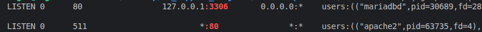
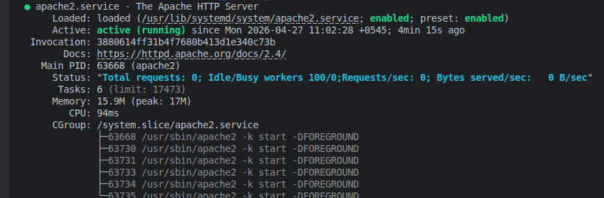
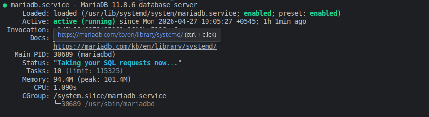
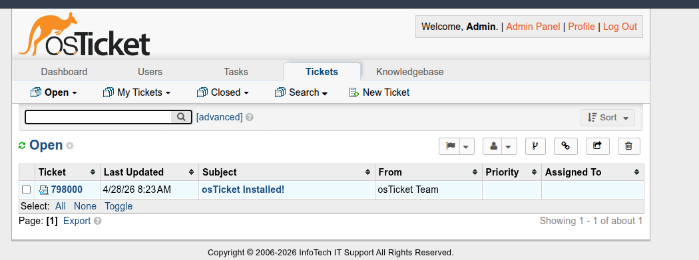
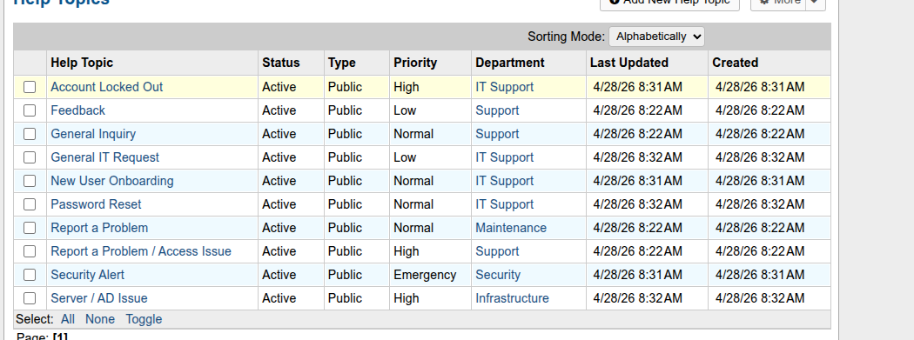
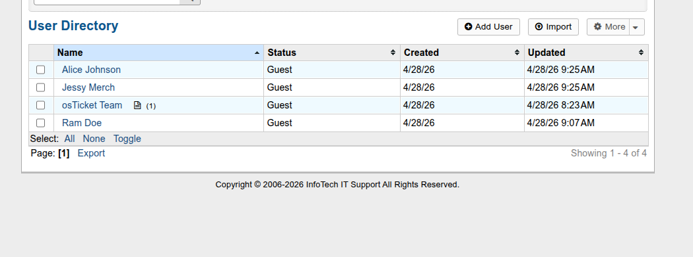
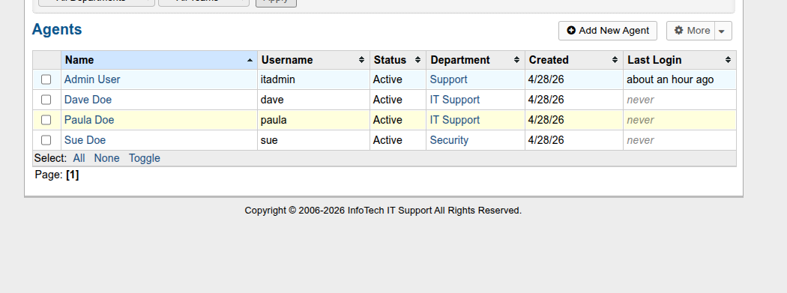
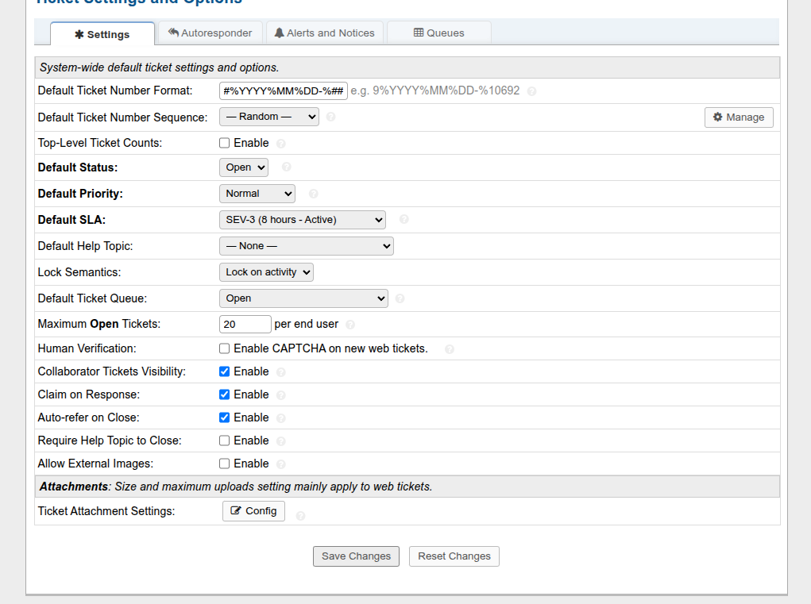
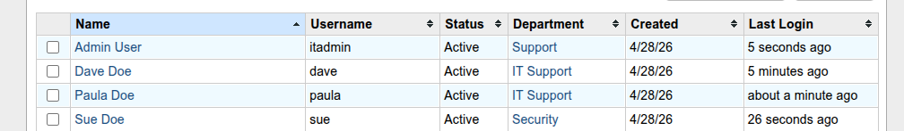

# 🎫 ITSM Helpdesk Lab — osTicket on Ubuntu 25

> A fully functional IT Service Management system built on **osTicket** — deployed on Ubuntu 25,
> running alongside the Wazuh SIEM stack, and populated with real tickets from incidents
> generated across the [AD & Windows Server Labs](https://github.com/your-username/ad-windows-server-labs),
> [AD Automation Toolkit](https://github.com/your-username/ad-automation-toolkit), and
> [Wazuh SIEM Lab](https://github.com/your-username/wazuh-siem-lab) projects.

<div align="center">


</div>

---

## 📌 Overview

Every IT support role runs on a ticketing system. This project deploys **osTicket** —
a widely-used open-source ITSM platform — and simulates a real Helpdesk environment
using incidents generated from existing lab infrastructure.

**What this project demonstrates:**

- Deploying and configuring a production-grade ITSM platform from scratch on Linux
- Configuring departments, teams, SLA plans, and help topic routing
- Diagnosing and documenting a real LDAP integration attempt with root cause analysis
- Managing real P1, P2, and P3 incident lifecycles with defined SLA timers
- Writing escalation workflows and a Helpdesk operational runbook
- Connecting three lab projects into a single documented support environment

---

## 🖥️ Environment

<table>
<tr>
<td width="50%" valign="top">

**Infrastructure**
| Component | Details |
|-----------|---------|
| **ITSM Platform** | osTicket 1.18.1 on Ubuntu 25 |
| **Web URL** | `http://192.168.1.xx/osticket` |
| **Database** | MariaDB |
| **Web Server** | Apache2 + PHP 8.x |
| **Authentication** | osTicket local auth |
| **Domain** | `InfoTech.com` |
| **Primary DC** | `VM-WINSERV-01` — `192.168.1.10` |

</td>
<td width="50%" valign="top">

**Agents & Departments**
| Agent | Department | Role |
|-------|------------|------|
| `itadmin` | — | Administrator |
| `paula` | IT Support / Infrastructure | Senior Agent |
| `dave` | IT Support | Level I Agent |
| `sue` | Security | Senior Agent |

</td>
</tr>
</table>

---

## 🏗️ Architecture

```
┌──────────────────────────────────────────────────┐
│           Ubuntu 25 Host (192.168.1.xx)          │
│                                                  │
│   osTicket 1.18.1  (Apache2 + PHP + MariaDB)    │
│   Port 80 → http://192.168.1.xx/osticket        │
│                                                  │
│   Wazuh SIEM also running on this host           │
│   Port 443 → https://192.168.1.xx               │
└──────────────────────────────────────────────────┘
                    │ references
        ┌───────────┴────────────┐
        ▼                        ▼
┌───────────────┐       ┌───────────────┐
│ VM-WINSERV-01 │       │ VM-WINSERV-02 │
│ 192.168.1.10  │       │ 192.168.1.12  │
│ Primary DC    │       │ Secondary DC  │
└───────────────┘       └───────────────┘
```

---

## 📁 Repository Structure

```
itsm-helpdesk-lab/
│
├── tickets/
│   ├── P1-replication-failure.md       # P1 — AD replication error 8524
│   ├── P2-account-lockout.md           # P2 — Administrator locked out
│   ├── P2-brute-force-detection.md     # P2 — Wazuh brute force alert
│   └── P3-new-user-onboarding.md       # P3 — New hire onboarding
│
├── workflows/
│   ├── sla-policy.md                   # SLA plan definitions
│   ├── p1-incident-response.md         # P1 escalation workflow
│   └── p2-incident-response.md         # P2 escalation workflow
│
├── config/
│   ├── osticket-settings.md            # Full configuration reference
│   └── ad-integration.md               # LDAP attempt + local auth decision
│
├── docs/
│   └── runbook.md                      # Helpdesk operational runbook
│
└── README.md
```

---

## 🧩 Build Progress

| #   | Phase                                                      | Status |
| --- | ---------------------------------------------------------- | ------ |
| 1   | Install LAMP stack (Apache, PHP, MariaDB) on Ubuntu        | ✅     |
| 2   | Install and configure osTicket 1.18.1                      | ✅     |
| 3   | Configure departments, teams, SLA plans, and help topics   | ✅     |
| 4   | AD/LDAP authentication — attempted, local auth implemented | ✅     |
| 5   | Create and document 4 real tickets from lab incidents      | ✅     |
| 6   | Write SLA policy and P1/P2 escalation workflows            | ✅     |
| 7   | Write Helpdesk runbook + push to GitHub                    | ✅     |

---

## 🎫 Tickets

| ID            | Priority | Title                               | SLA   | Source Lab               |
| ------------- | -------- | ----------------------------------- | ----- | ------------------------ |
| `#2026041401` | 🔴 P1    | AD Replication Failure — Error 8524 | SEV-1 | AD & Windows Server Labs |
| `#2026041402` | 🟠 P2    | Administrator Account Locked Out    | SEV-2 | Wazuh SIEM Lab           |
| `#2026041403` | 🟠 P2    | Brute Force Alert — wazuhtest       | SEV-2 | Wazuh SIEM Lab           |
| `#2026041404` | 🟡 P3    | New User Onboarding — Jane Smith    | SEV-3 | AD Automation Toolkit    |

---

## 📋 SLA Plans

| Plan    | Grace Period | Schedule       | Priority      |
| ------- | ------------ | -------------- | ------------- |
| `SEV-1` | 1 hour       | 24/7           | Critical — P1 |
| `SEV-2` | 4 hours      | 24/7           | High — P2     |
| `SEV-3` | 8 hours      | Business hours | Medium — P3   |
| `SEV-4` | 72 hours     | Business hours | Low — P4      |

---

---

# ✅ Phase 1 — Install the LAMP Stack

Apache2, PHP 8.x, and MariaDB installed on Ubuntu 25 to host osTicket.
Port 80 confirmed free — Wazuh Dashboard uses port 443 — no conflict.

```bash
sudo apt update && sudo apt upgrade -y
sudo apt install apache2 -y
sudo apt install mariadb-server mariadb-client -y
sudo mariadb-secure-installation          # Ubuntu 26 renamed the command
sudo apt install php php-mysqli php-gd php-xml php-mbstring \
    php-intl php-apcu php-curl php-zip libapache2-mod-php -y
```

**osTicket database created:**

```sql
CREATE DATABASE osticket;
CREATE USER 'osticket'@'localhost' IDENTIFIED BY 'osTicket@12345!';
GRANT ALL PRIVILEGES ON osticket.* TO 'osticket'@'localhost';
FLUSH PRIVILEGES;
```

**Outcome:** Apache on port 80, MariaDB on port 3306, PHP 8.x — all confirmed running ✅

## 📸 Screenshots

<p align="center">
  
  
</p>
<p align="center">
  
</p>

---

# ✅ Phase 2 — Install osTicket

```bash
cd /tmp
wget https://github.com/osTicket/osTicket/releases/download/v1.18.1/osTicket-v1.18.1.zip
unzip osTicket-v1.18.1.zip -d osTicket
sudo mv osTicket/upload /var/www/html/osticket
sudo chown -R www-data:www-data /var/www/html/osticket
sudo cp /var/www/html/osticket/include/ost-sampleconfig.php \
        /var/www/html/osticket/include/ost-config.php
sudo chmod 0666 /var/www/html/osticket/include/ost-config.php
sudo a2enmod rewrite && sudo systemctl restart apache2
```

Web installer run at `http://192.168.1.xx/osticket/setup` with:

| Field          | Value                                            |
| -------------- | ------------------------------------------------ |
| Helpdesk Name  | `InfoTech IT Support`                            |
| Admin Username | `itadmin` _(not `admin` — reserved by osTicket)_ |
| Database       | `osticket` / `osticket` user                     |

Post-install cleanup:

```bash
sudo rm -rf /var/www/html/osticket/setup
sudo chmod 0644 /var/www/html/osticket/include/ost-config.php
```

**Outcome:** Admin panel live at `http://192.168.1.xx/osticket/scp` ✅

## 📸 Screenshots

<p align="center">
  
  
</p>

---

# ✅ Phase 3 — Departments, Teams, SLA Plans & Help Topics

> Full config reference: [`config/osticket-settings.md`](config/osticket-settings.md)

**Departments created:** IT Support (public), Infrastructure (private), Security (private)

**Teams created:** Level I Support (Dave), Level II Support (Paula + Sue)

**SLA Plans configured:**

| Plan  | Grace  | Schedule       |
| ----- | ------ | -------------- |
| SEV-1 | 1 hr   | 24/7           |
| SEV-2 | 4 hrs  | 24/7           |
| SEV-3 | 8 hrs  | Business hours |
| SEV-4 | 72 hrs | Business hours |

**Help Topics → SLA mapping:**

| Help Topic          | Department     | SLA   |
| ------------------- | -------------- | ----- |
| Security Alert      | Security       | SEV-1 |
| Server / AD Issue   | Infrastructure | SEV-1 |
| Account Locked Out  | IT Support     | SEV-2 |
| New User Onboarding | IT Support     | SEV-3 |
| Password Reset      | IT Support     | SEV-3 |
| General IT Request  | IT Support     | SEV-4 |

**Outcome:** All departments, teams, SLA plans, and help topics configured ✅

## 📸 Screenshots


<p align="center">
  
  
</p>

<p align="center">
  
</p>

---

# ✅ Phase 4 — Agent Authentication

> Full LDAP attempt details: [`config/ad-integration.md`](config/ad-integration.md)

## LDAP Integration — Attempted

LDAP was attempted to allow agents to authenticate with InfoTech.com AD credentials.
All steps were completed — PHP LDAP extension, plugin built from source as `.phar`,
`Net_LDAP2` installed via PEAR — but a version incompatibility between
osTicket 1.18.1 and Net_LDAP2 path resolution on Ubuntu 26 prevented successful connection.

| Attempt                             | Result          |
| ----------------------------------- | --------------- |
| Built `auth-ldap.phar` from source  | ✅ Deployed     |
| Installed `Net_LDAP2` via PEAR      | ✅ Installed    |
| Added PEAR path to `php.ini`        | ❌ Still failed |
| Symlinked Net into osTicket include | ❌ Still failed |
| Copied Net directly into osTicket   | ❌ Still failed |

**Error:** `Failed opening required 'include/Net/LDAP2.php'` — phar internal
paths cannot resolve system-wide PEAR libraries on Ubuntu 26.

## Local Authentication — Implemented

osTicket local auth used instead — standard in most production deployments.
Agent usernames match AD identities for portfolio consistency:

| Agent     | Username    | AD Identity              |
| --------- | ----------- | ------------------------ |
| Admin     | `itadmin`   | `Administrator`          |
| Paula Doe | `paula` | `paula.doe@InfoTech.com` |
| Dave Doe  | `dave`  | `dave.doe@InfoTech.com`  |
| Sue       | `sue`       | `sue@InfoTech.com`       |

**Outcome:** All agents active, LDAP attempt fully documented ✅

## 📸 Screenshots

<p align="center">
  
</p>

---

# ✅ Phase 5 — Real Tickets from Lab Incidents

Four real tickets created in osTicket — each sourced from an actual incident
across the three previous lab projects.

> Full ticket documentation in [`tickets/`](tickets/)

## 🔴 Ticket #2026041401 — P1 — AD Replication Failure

| Field               | Details                |
| ------------------- | ---------------------- |
| **SLA**             | SEV-1 — 1 hour grace   |
| **Department**      | Infrastructure         |
| **Assigned To**     | Paula Doe              |
| **Resolution Time** | 1h 45min ✅ within SLA |

**Summary:** AD replication failing with error 8524 (DNS lookup failure) —
10 consecutive failures between VM-WINSERV-01 and VM-WINSERV-02.
Root cause: DNS misconfiguration on secondary DC + IPv6 interference.
Fixed via DNS reorder, `ipconfig /registerdns`, IPv6 disabled, `repadmin /syncall /AdeP`.

📄 [`tickets/P1-replication-failure.md`](tickets/P1-replication-failure.md)

---

## 🟠 Ticket #2026041402 — P2 — Administrator Account Locked Out

| Field               | Details                |
| ------------------- | ---------------------- |
| **SLA**             | SEV-2 — 4 hour grace   |
| **Department**      | IT Support             |
| **Assigned To**     | Paula Doe              |
| **Resolution Time** | 1h 30min ✅ within SLA |

**Summary:** Built-in Administrator locked out on both DCs during Wazuh lockout
testing. Local password also unknown. Recovered via Utilman.exe replacement
technique through Windows Recovery Mode on both servers.

📄 [`tickets/P2-account-lockout.md`](tickets/P2-account-lockout.md)

---

## 🟠 Ticket #2026041403 — P2 — Brute Force Alert

| Field               | Details                |
| ------------------- | ---------------------- |
| **SLA**             | SEV-2 — 4 hour grace   |
| **Department**      | Security               |
| **Assigned To**     | Sue                    |
| **Resolution Time** | 1h 05min ✅ within SLA |

**Summary:** Wazuh Rule 100102 (Level 12) fired — 5 failed logins for `wazuhtest`
within 32 seconds from CLIENT-WIN11. Investigated, confirmed as intentional rule
validation test. Account unlocked, rules confirmed working correctly.

📄 [`tickets/P2-brute-force-detection.md`](tickets/P2-brute-force-detection.md)

---

## 🟡 Ticket #2026041404 — P3 — New User Onboarding

| Field               | Details                |
| ------------------- | ---------------------- |
| **SLA**             | SEV-3 — 8 hour grace   |
| **Department**      | IT Support             |
| **Assigned To**     | Dave Doe               |
| **Resolution Time** | 2h 30min ✅ within SLA |

**Summary:** New hire Jane Smith starting Monday. Account created using
`New-UserOnboard.ps1` from the AD Automation Toolkit — one command provisioned
the AD account, OU placement, group membership, and drive mapping.
Estimated 25 minutes saved vs manual ADUC process.

📄 [`tickets/P3-new-user-onboarding.md`](tickets/P3-new-user-onboarding.md)


---

# ✅ Phase 6 & 7 — SLA Workflows, Runbook & Final Documentation

> Escalation workflows: [`workflows/`](workflows/)
> Operational runbook: [`docs/runbook.md`](docs/runbook.md)
> SLA policy: [`workflows/sla-policy.md`](workflows/sla-policy.md)

## Auto-Routing Configuration

| Help Topic          | Routes To           | First Responder |
| ------------------- | ------------------- | --------------- |
| Security Alert      | Security dept       | Sue             |
| Server / AD Issue   | Infrastructure dept | Paula Doe       |
| Account Locked Out  | IT Support dept     | Dave Doe        |
| New User Onboarding | IT Support dept     | Dave Doe        |
| Password Reset      | IT Support dept     | Dave Doe        |

## Real Troubleshooting Documented

| Issue                                 | Root Cause                                            | Fix                                       |
| ------------------------------------- | ----------------------------------------------------- | ----------------------------------------- |
| LDAP plugin fatal error               | Folder-based plugin incompatible with osTicket 1.18.x | Built `.phar` from source                 |
| `Net_LDAP2` path error                | PEAR library inaccessible inside `.phar` archive      | Local auth used instead — documented      |
| `mysql_secure_installation` not found | Ubuntu 26 renamed the command                         | Used `mariadb-secure-installation`        |
| `admin` username rejected             | Reserved word in osTicket                             | Used `itadmin`                            |
| `php-imap` not found                  | Ubuntu 26 package naming — optional extension         | Skipped — not required for core functions |

---

<div align="center">


**☁️ Built for learning • ⭐ Star if you find this useful**

_Part of a series:_
[AD & Windows Server Labs](https://github.com/sharmaSagar01/Active-Directory-Lab) •
[AD Automation Toolkit](https://github.com/sharmaSagar01/ad-automation-toolkit) •
[Wazuh SIEM Lab](https://github.com/sharmaSagar01/wazuh-siem-lab) •
[ITSM Helpdesk Lab](https://github.com/sharmaSagar01/itsm-helpdesk-lab) •
[Azure Hybrid Identity Lab](https://github.com/sharmaSagar01/azure-hybrid-identity-lab) •
[AWS Cloud Infrastructure Lab](https://github.com/sharmaSagar01/aws-cloud-infra-lab)

</div>
